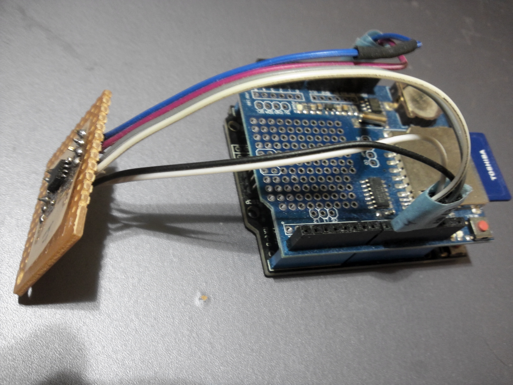
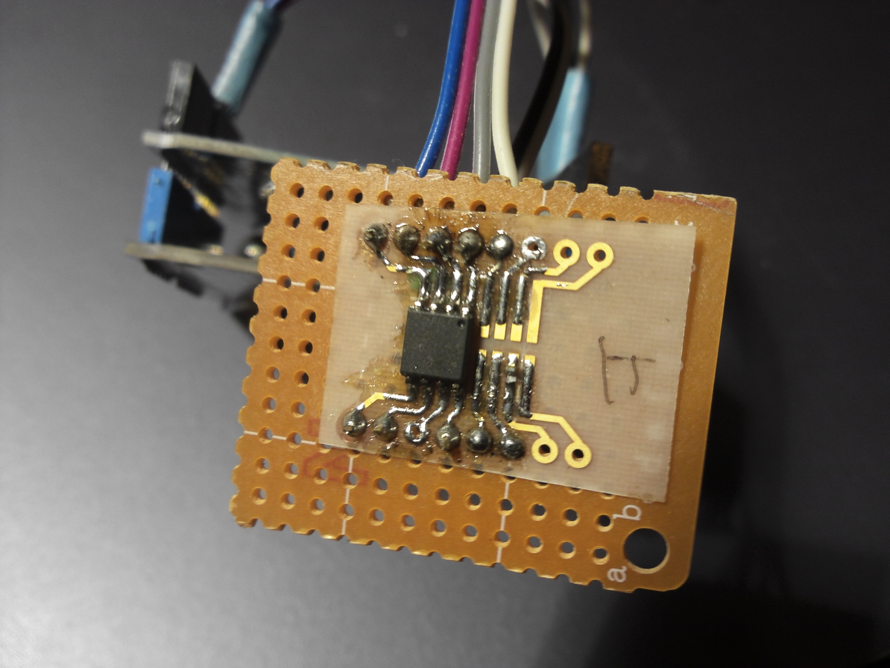

# SerialFlashROMWriter
・SDメモリ→シリアルフラッシュROMへ書き込み

・シリアルフラッシュROM→SDメモリへ読み出し

Openwrt(A5-V11)のシリアルフラッシュROMを4MB→16MBに置換した。

その際に、u-bootをArduinoを使って書き込んだツール

(読み出しもあります)

 以下のROMで実績があります。大概のシリアルフラッシュROMはいけると思います。

 ・Q32C-104(32Mbit、4Mbyte)

 ・W25Q128(128Mbit、16Mbyte)

 ・PN25F08(8Mbit、1Mbyte)

# 構成
・ Arduino UNO
・ SDカードシールド
・ シリアルフラッシュROM基板
  
 
  
  
  抵抗はSMDで裏側
  
  https://github.com/Tamakichi/Arduino-W25Q64
  
 
